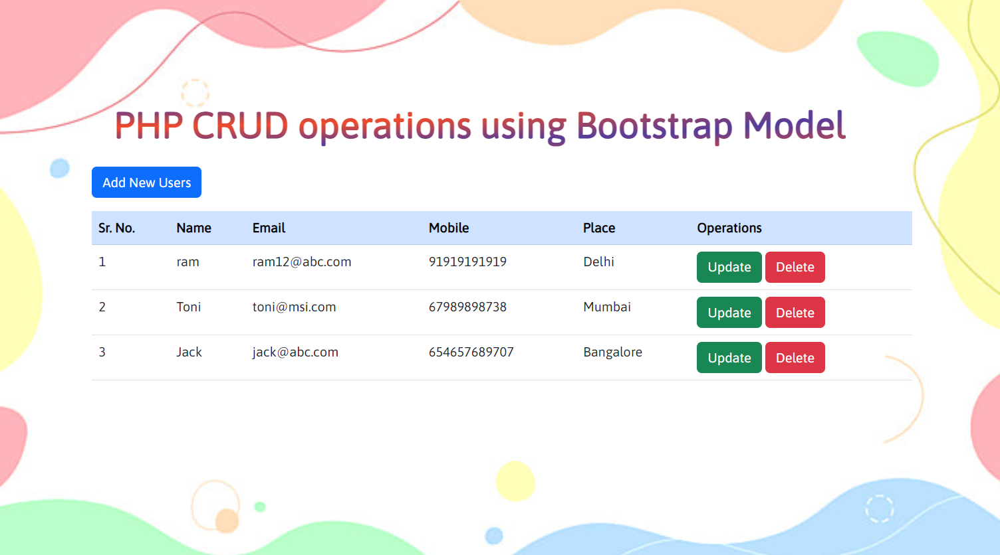

# PHP-Bootstrap-model
- Build **CRUD** operation's model using PHP, Bootstrap, jQuery and AJAX
- Funnction: We can Create, Read, Update and Delete (CRUD) User's details easily.

## Dashboard

## Overview: Playing with Model 
<!-- I got this link just by drag and drop -->
https://user-images.githubusercontent.com/87716096/175021555-78e91a7b-5393-4776-8efe-843a1f141dcb.mp4

 

_Any doubts?  --> Ask me on [website](https://swasdas.github.io/) or [mail](mailto:swastik.sarc@gmail.com) me._
